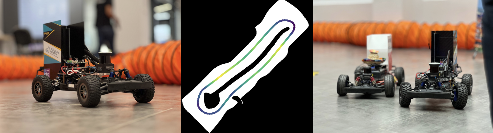

<h1 align="center">🚗 Welcome to the SZE F1TENTH GitHub organization!</h1>

> This space is dedicated to supporting research, collaborative development, and teamwork for students and contributors involved in the F1TENTH project at **Széchenyi István University**.

---

## 🔒 **Private Repositories**

> Please note that many repositories in this organization are private for a reason — they contain sensitive materials, ongoing work, or competition-related content. 
> **Do not share any of this content externally unless explicitly authorized.**

---

## 🧑‍💼 **Access Requests**

If you are part of the project but don’t yet have access to a specific repository, please contact one of the current team leads(2025.08.28.):

<table>
  <tr>
    <td align="center">
      <a href="https://github.com/rudolfkrecht">
         
        <b>Rudolf Krecht</b> 
        <a href="https://github.com/rudolfkrecht">@rudolfkrecht</a>
      </a>
    </td>
    <td align="center">
      <a href="https://github.com/szonyibalazs">
         
        <b>Balázs Szőnyi</b> 
        <a href="https://github.com/szonyibalazs">@szonyibalazs</a>
      </a>
    </td>
    <td align="center">
      <a href="https://github.com/h-leda">
         
        <b>Léda Hamvas</b> 
        <a href="https://github.com/h-leda">@h-leda</a>
      </a>
    </td>
  </tr>
</table>

---

  

